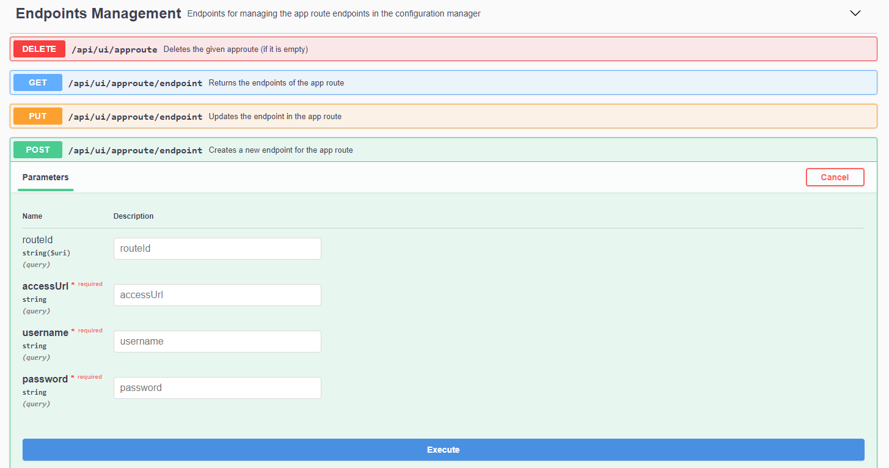
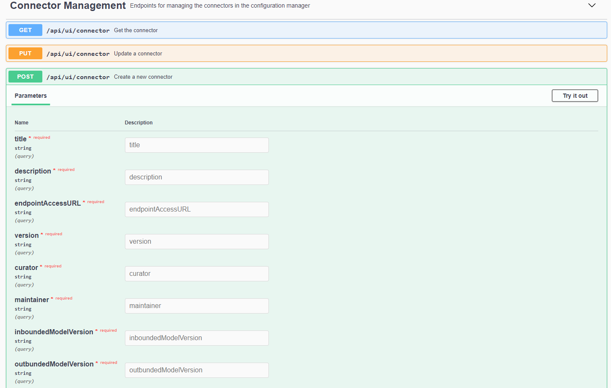

# IDS - Configuration Manager

The configuration manager is the administrative part of a connector.
It main task is to manage and validate the configuration model,
followed by the deployment of the connector.
The configuration model is an extensible domain model which describes the configuration
of a connector. It consists of technology-independent, interconnected configuration aspects.

In the current version the development of configuration manager is linked to the open source project
[Dataspace Connector](https://github.com/FraunhoferISST/DataspaceConnector).

This repository has a develop branch in addition to the master branch.
The idea is to always merge other branches into the develop branch (as SNAPSHOT version) and to push 
the changes from there into the master only for releases. 
This way, the develop branch is always up to date, with the risk of small issues, 
while the master only contains official releases.

## Table of Contents

<!-- TOC -->
- [Features](#features)
    - [Technologies](#technologies)
    - [IDS Components](#ids-components)
- [Getting Started](#getting-started)
    - [Installing](#installing)
- [Backend API](#backend-api) 
- [Hands-on IDS Configurationmanager](#hands-on-ids-configurationmanager)
- [Versioning](#versioning)
- [Authors](#authors)
- [License](#license)
<!-- TOC -->

---

<a name="features"></a>
## Features

This is a list of currently implemented features, which is continuously updated.

* The configuration model can be managed and is stored in an internal H2 database
* Proxy settings for the ConfigModel can be made
* Endpoints can be created and edited for the configuration model
* The configuration model can be provided with a connector description
* The available brokers can be retrieved, which are located in an internal H2 database
    * Connectors can be registered with a broker, removed or updated
* Resources can be stored in the connector and in the app route of the configuration model
    * A representation can be created and managed for each resource
    * Contracts can be retrieved and updated for each resource
* The Dataspace Connector is notified about every change in the configuration model,
 e.g. when changes are made to resources, the connector or the configuration model itself  


<a name="technologies"></a>
### Technologies
`Java`, `Maven`, `Spring Boot`, `Rest`, `OpenAPI`, `Swagger`, `SLF4J`, `JSON(-LD)`

<a name="IDS Components"></a>
### IDS Components

| Library/Component | Version | License | Owner | Contact |
| ------ | ------ | ------ | ------ | ------ |
| [IDS Information Model Library](https://maven.iais.fraunhofer.de/artifactory/eis-ids-public/de/fraunhofer/iais/eis/ids/infomodel/) | 4.0.0 | Apache 2.0 | Fraunhofer IAIS | [Sebastian Bader](mailto:sebastian.bader@iais.fraunhofer.de) |
| [IDS Information Model Serializer Library](https://maven.iais.fraunhofer.de/artifactory/eis-ids-public/de/fraunhofer/iais/eis/ids/infomodel-serializer/) | 4.0.0 | Apache 2.0 | Fraunhofer IAIS | [Sebastian Bader](mailto:sebastian.bader@iais.fraunhofer.de) |
| [Dataspace Connector](https://github.com/FraunhoferISST/DataspaceConnector) | 3.2.1 | Apache 2.0 | Fraunhofer ISST | [Julia Pampus](mailto:julia.pampus@isst.fraunhofer.de) |
---
<a name="getting-started"></a>
## Getting Started

You need:
* Maven
* REST client for testing, like ARC

<a name="installing"></a>
### Installing

Clone the project from
```
https://www.ids.isst.fraunhofer.de/bitbucket/scm/idsp/ids-configurationmanager.git
```
open the directory and run 
```
mvn clean package
```
When building was successfully, go into target folder and run
```
java -jar configmanager-0.0.1-SNAPSHOT.jar
```
in terminal to start the configuration manager.

---
<a name="backend-api"></a>
## Backend API

In the following, the different APIs are described and explained. Most of the interfaces are used to set the
configuration of configuration model, connector, brokers etc. via the user interface.

*  `Configuration model API: ` The API provides CRUD operations to manage the Configuration Model.
*  `Configuration model Proxy API: ` The API helps to make proxy settings for the configuration model.
*  `Endpoint API: ` With the API app routes can be configured.
                    The CRUD operations are also available here. 
*  `Connector API: ` The Connector API helps to manage the connector description
                     in the configuration model.
*  `Broker API: ` The Broker API helps to manage individual brokers. It offers several endpoints
                  to manage the brokers. Beside the CRUD operations there are also endpoints
                  which help to update, register or unregister a connector with the broker.
*  `Resource API: `Connectors and app routes include resources provided by data providers.
                   The Resource API helps to manage the resources in the connector and in the app routes.
*  `Resource contract API: ` The API helps to retrieve or update the contracts of a resource.
*  `Resource representation API: ` A resource can have different representations.
                                   With the API the representations can be managed.

* `Database: `The data resources are persist in an H2 database.
              Console path: `http://localhost:8080/console`
---
<a name="hands-on-ids-configurationmanager"></a>
## Hands-on IDS Configurationmanager

To interact with the running application, the provided endpoints at the Swagger UI can be used.
The Swagger UI is available at: `http://localhost:8080/swagger-ui/index.html?url=/v3/api-docs/` .

The following is an example of how the configuration model can be extended step by step in the Configuration Manager.
The following points are discussed:

* Creating an endpoint
* Create connector description
* Create resource and view the result

`Step 1) Creating an endpoint`

To create an endpoint for the configuration model, the API POST `/api/ui/approute/endpoint` can be used.



Here information like the accessURL, username and password must be given.
After an endpoint has been successfully created, a similar respsonse should be displayed:
```
{
  "msg": "Successfully created endpoint!",
  "routeID": "https://w3id.org/idsa/autogen/appRoute/08e324a5-9045-4678-8995-5444a4899363",
  "endpointId": "de.fraunhofer.iais.eis.GenericEndpointImpl@66a37ac0"
}
```

`Step 2) Create connector description`

Next, you can add a connector description to the configuration model.
You can use the API POST `/api/ui/connector` for this.



Here the individual fields such as title, description, access url etc. must be filled out to create a connector.
After successful completion of the process the response message `Successfully created a new connector` should appear.

`Step 3) Create resource and view the result` 

Like the other steps you can use the API POST `/api/ui/resource` to create a resource.


All required fields must also be filled out here. A special field in this context is "brokerList",
where you can specify under which broker the resource is available.

After a successful creation of a resource a similar response message should appear:
```
{
  "connectorResponse": "Resource registered with uuid: 61360ba4-b50d-4259-8bd5-a054c731b004",
  "resourceID": "https://w3id.org/idsa/autogen/resource/61360ba4-b50d-4259-8bd5-a054c731b004"
}
```
The special feature of this response message is that besides the resource id the connector response is also displayed.
This means that the creation of the resource was successful and the dataspace connector was notified about the change.

---

<a name="versioning"></a>
## Versioning

Please read the `CHANGELOG.md` for versioning details.

---

<a name="authors"></a>
## Authors
* **Steffen Biehs**  - *Initial work, implementation*
* **Erik van den, Akker** - *Initial work, implementation* 
* **Gökhan Kahriman** - *Initial work, implementation*

---

<a name="license"></a>
## License
This project is licensed under the Apache License 2.0 - see the LICENSE.md file for details.
